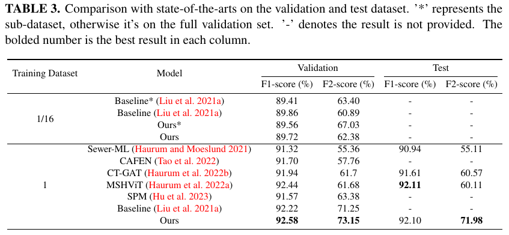

# Tips
After the paper is fully accepted, we will publicly release all the code, including the training code.

# Introdunction
This is the official implementation of the paper "Multi-label Sewer Pipe Defect Recognition with Mask Attention Feature Enhancement and Label Correlation Learning".
## Abstract

The coexistence of multiple defect categories as well as the substantial class imbalance problem significantly impair the performance of the detection of sewer pipeline defects. To solve this problem, a multi-label pipe defect recognition method is proposed based on mask attention guided feature enhancement and label correlation learning. The proposed method can achieve current approximate state-of-the-art classification performance using just 1/16 of the Sewer-ML training dataset and exceeds the current best method by 11.87\% in terms of F2 metric on the full dataset, while also proving the superiority of the model. The major contribution of this study is to the development of a more efficient model for identifying and locating multiple defects in sewer pipe images for a more accurate sewer pipeline condition assessment. Moreover, by employing class activation maps, our method can accurately pinpoint multiple defect categories in the image which demonstrates a strong model interpretability.

## Results on Sewer-ML:



# Quick start
0. (optional) Star this repo. 

1. Clone this repo:
```sh
git clone git@github.com:shengyu27/MA-Q2L.git
cd MA-Q2L
```

2. Install [```cuda```](https://developer.nvidia.com/cuda-downloads), [```PyTorch``` and ```torchvision```](https://pytorch.org/).

Please make sure they are compatible.
We test our models on two envs and other configs may also work:
```sh
cuda==11, torch==1.9.0, torchvision==0.10.0, python==3.7.3
or
cuda==10.2, torch==1.6.0, torchvision==0.7.0, python==3.7.3
```

3. Install other needed packages.
```sh
pip install -r requirments.txt
```

4. Data preparation.

Download [Sewer-ML](http://vap.aau.dk/sewer-ml).
### Dataset

After downloading the data from the official website, you need to convert it into the following structure:
```
MA-q2l
├── dataset
│   ├── trainAll
│   │   ├── 00000001.png
│   │   ├── 00000002.png
│   │   ├── ...
│   │   ├── 01300201.png
│   ├── valAll
│   │   ├── 00000048.png
│   │   ├── 00000049.png
│   │   ├── ...
│   │   ├── 01299740.png
│   ├── trainAll_sub_0.0625
│   │   ├── 00000001.png
│   │   ├── 00000011.png
│   │   ├── ...
│   │   ├── 00812097.png
│   ├── valAll_sub_0.0625
│   │   ├── 00000048.png
│   │   ├── 00000207.png
│   │   ├── ...
│   │   ├── 00803778.png
│   ├── SewerML_Train.csv
│   ├── SewerML_Train_sub_0.0625.csv
│   ├── SewerML_Val.csv
│   ├── SewerML_Val_sub_0.0625.csv
```
## Train
```sh
python main.py \
--dataset_dir '/dataset' \
--backbone resnet101 --dataname sewerml --batch-size 16 --print-freq 100 \
--output "/output" \
--world-size 1 --rank 0 --dist-url tcp://127.0.0.1:3717 \
--dtgfl \
--epochs 40 --lr 1e-5 --optim Adam_twd --pretrained \
--num_class 17 --img_size 448 --weight-decay 1e-2 \
--hidden_dim 2048 --dim_feedforward 8192 

```

## Val/Test
```sh
##step1:
python infer.py  --checkpoint /path/to/your/checkpoint --dataset_size 1 --dataset_dir /dataset --output /dir/to/ouput
##step2:
python calculate_results.py --split val --score_path /path/to/infer --gt_path /path/to/datset --val_csv_name name
```

# Pretrianed Models
## Download pretrained models.
| Modelname     | F1-score(%) | F2-score(%) | link(Google drive) | 
|---------------|-------------|-------------|------------| 
| MA-Q2L-0.0625 | 89.56       | 67.03       | [link](https://drive.google.com/file/d/1ngPdoqRUhFajnQY3iMyBJDWWN9kPL9Fo/view?usp=drive_link)     |
| MA-Q2L-1      | 92.58       | 73.15       | [link](https://drive.google.com/file/d/1m9fR1XLqUFATIs14bA9gXwcEsAp03KB6/view?usp=drive_link)     |


note: \
MA-Q2L-0.0625 represents training and validation on the sub-dataset  \
MA-Q2L-1 represents training and validation on the complete dataset


# Acknowledgement
We thank the authors of [Sewer-ML](https://vap.aau.dk/sewer-ml/),[Q2L](https://github.com/SlongLiu/query2labels), [ASL](https://github.com/Alibaba-MIIL/ASL) for their great works and codes.
